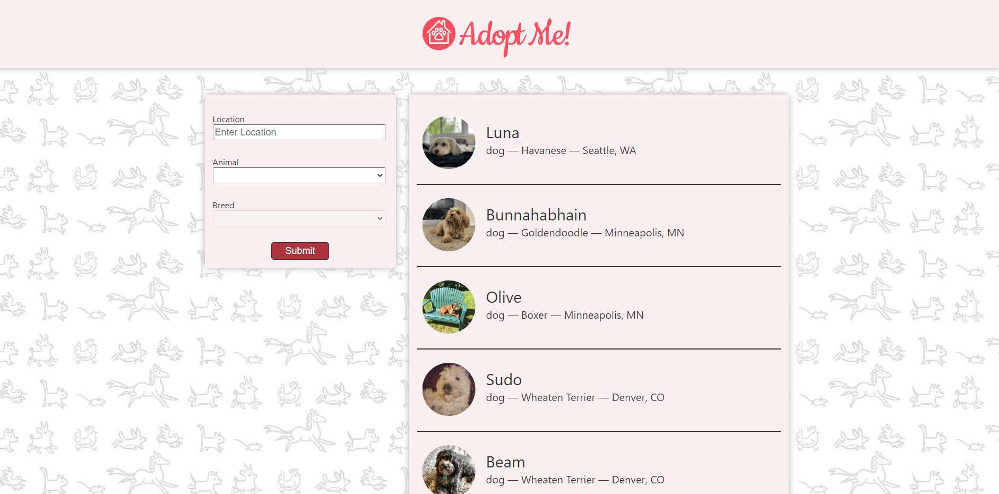

# Adopt Me

Adopt Me is an online pet adoption center built with React.

## Learning Experience

- React development with practical application
- Component-based UI organization
- Efficient state management
- Integrated external APIs dynamically (In Progress)
- Responsive design implementation
- Routing and seamless navigation
- Form handling and validation
- Testing and debugging practices
- Deployment and continuous integration (In Progress)

These are just a few noteworthy mentions of the full learning experience this project offered.
